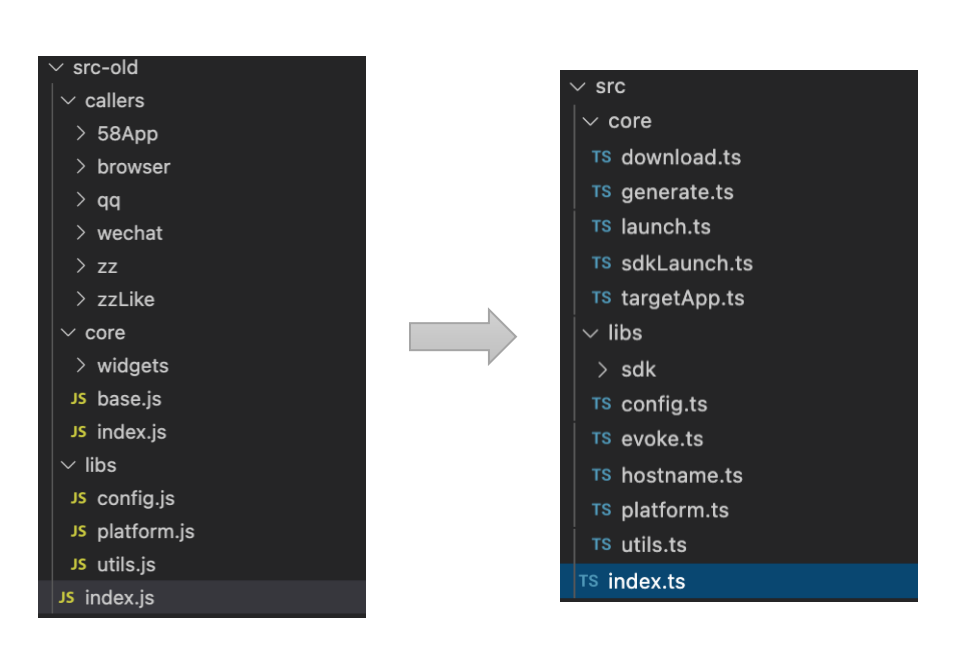
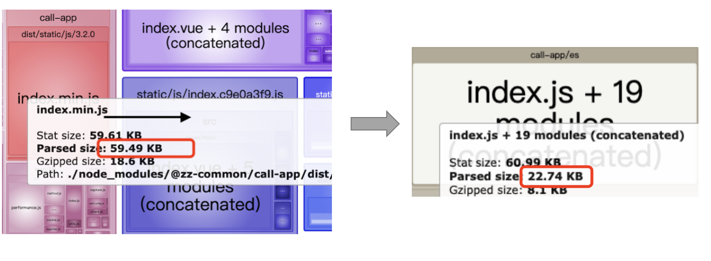
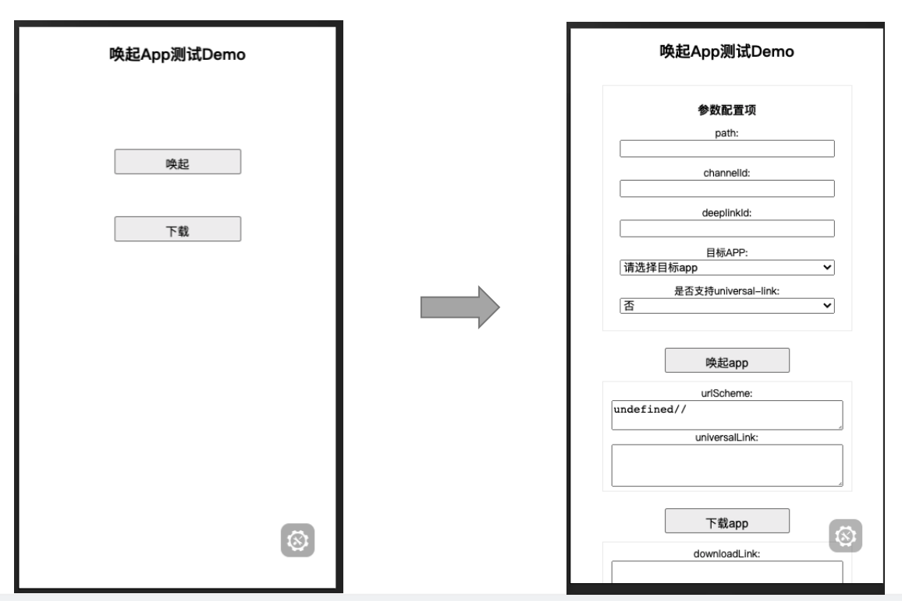
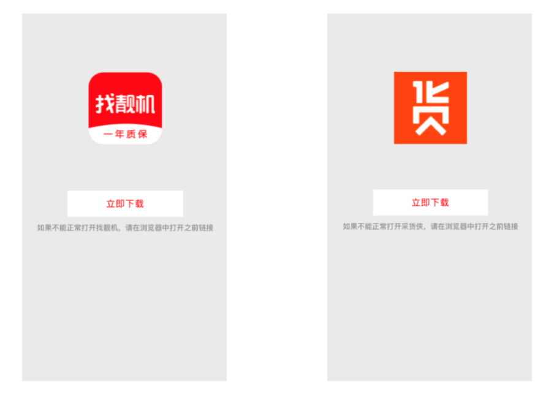

## V4.0.0 升级内容

#### 1. 项目整体架构升级

- 1-1 以唤起平台业务逻辑划分 -> 以功能模块划分
- 1-2 大大减少了内部逻辑复杂度，削减了大量冗余代码
- 1-3 提高了项目整体的易读性
  - 流式+模块化逻辑大大缩短了代码阅读理解负担 (预估时间 2day 缩短到 0.5day)

新的架构:

新旧目录 diff:

#### 2. 无用代码剔除，代码逻辑优化，缺陷修复

- 2-1 移除 一格/切克 app 代码逻辑
- 2-2 内部逻辑缺陷改动
- 2-3 浏览器运行时旧代码 bug 修复

#### 3. 支持找靓机/采货侠，支持一键配置唤起第三方 app

- 3-1 新增支持找靓机， 支持采货侠
- 3-2 添加 customConfig 选项，支持第三方配置（例如 唤起支付宝）

#### 4. 测试覆盖更广更细

- 4-1 由于项目老旧，原有测试覆盖已不满足需求（兼容性问题）
- 4-2 分别在 ios/android 覆盖了 10+个运行时平台，case 90+（详细见说明文档）

#### 5. 支持 ts, 体积优化, 完善代码注释，完善 demo

- 5-1 支持 ts, 提升健壮性 同时满足业务同学对 ts 的诉求
- 5-2 体积优化, 由原来 60k 减少到 23k
- 5-3 代码注释丰富，增加维护性
- 5-4 demo 完善，方便测试/调试

体积:

测试 demo:

#### 6. 添加调试信息，异常信息，方便定位问题

- 6-1 统一进行调试信息/错误信息的管理
- 6-2 内部关键逻辑插入异常信息捕获，便于排查问题

log 统一捕获:

#### 7. 新增 hooks，方便逻辑插入

- 7-1. 新增三个钩子函数 `callStart / callSuccess / callFailed`
- 7-2. 新增内部异常钩子 `callError`

#### 8. 唤起中间页兼容找靓机/采货侠

